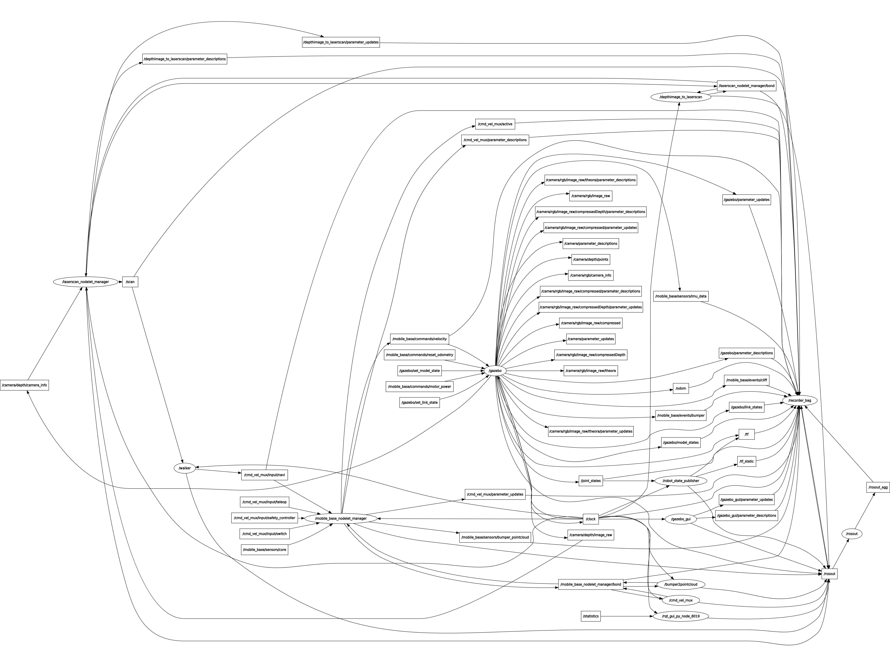

[](https://opensource.org/licenses/BSD-3-Clause)

<h1>ROS-walker turtlebot </h1>

</p>
<p align="center">

</p>

</p>
<p align="center">
Reference for image: <a href='http://www.ros.org/'>link</a>
</p>

## Project Overview
This project implements a object avoidance behavior using the motion base platform which is type of turtlebot, with simulation on gazebo. The turtlebot moves linearly and when it encounters a object it turns away to avoid the obstacle. The turtlebot also avoids the obstacles which are place in front of it while simulation is running. The rosbag file is generated in results directory, it can be played to see recoded published topics.

## Dependencies

This ROS node is made to be used on systems which have:
* ROS Kinetic
* Ubuntu 16.04
* Turtlebot packages

To install ROS, follow the instructions on this [link](http://wiki.ros.org/kinetic/Installation)

To install Turtlebot simulation stack type, Run the following after installing ROS Kinetic on your ubuntu 16.04.
```
$ sudo apt-get install ros-kinetic-turtlebot-gazebo ros-kinetic-turtlebot-apps ros-kinetic-turtlebot-rviz-launchers
```
## Build Instructions
#### Build Catkin Workspace
Open terminal and run the following command to clone this repository in it. The below command will start turtlebot gazebo simulation and walker node.
```
$ git clone https://github.com/krawal19/walker_turtlebot.git catkin_ws/src/walker_turtlebot
$ cd catkin_ws
```
#### Build the package
Use the below command to build the ROS package
```
$ catkin_make
```
## Running Instructions

To run code using launch command, open a new terminal window and run following command
```
$ cd <path to catkin_ws>
$ source devel/setup.bash
$ roslaunch walker_turtlebot turtle_walker.launch
```
To run each node separately using roscore, open a new terminal window and run following command
```
$ source /opt/ros/kinetic/setup.bash
$ roscore
```
In new terminal run
```
$ roslaunch  turtlebot_gazebo turtlebot_world.launch
```
Then is another terminal
```
$ rosrun walker_turtlebot walker
```
## Recording rosbag file
From the above process Rosbag file is recorded in the results directory under the title turtlebot_walker.bag

To view the summary of the contents in the bag file, use the command below
```
$ cd <path to repository>/results
$ rosbag info turtlebot_walker.bag
```
Note: Data of ~30 seconds is recorded using the above command.

## Playing rosbag file
Before running the previous recorded bag file close all the existing running processes and Run roscore and listener node by using the methods above. Then follow the commands below
```
$ cd <path to repository>/results
$ rosbag play turtlebot_walker.bag
```
After running the above command, recorded data output of the bag file will be same messages that are recorded.

Now to view the messages that are published on /cmd_vel_mux/input/navi
```
rostopic echo /cmd_vel_mux/input/navi
```
Similiarly we can echo other topics also to view published messages.

## Logging
To visualise logger messages in Qt-based framework, run the commands below after running roscore and nodes as mentioned above
```
$ rosrun rqt_console rqt_console
```
## Graphical visualization of ROS Nodes
Open a new terminal and run following command
```
$ rqt_graph
```
<p align="center">

</p>
